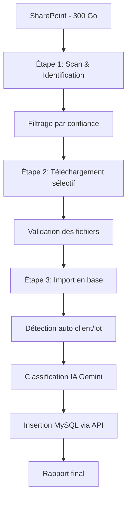

# Guide d'orchestration DPGF - Workflow automatisé complet

## Vue d'ensemble

Le script d'orchestration `orchestrate_dpgf_workflow.py` automatise complètement le processus d'identification, téléchargement et import des fichiers DPGF depuis SharePoint vers la base de données MySQL.

## Architecture du workflow



## Utilisation

### 1. Via l'interface batch (recommandé)
```bash
# Lancer l'interface interactive
run_dpgf_workflow.bat
```

### 2. Via la ligne de commande

#### Workflow automatique complet
```bash
# Workflow basique (sans IA)
python orchestrate_dpgf_workflow.py --auto

# Workflow avec IA Gemini
python orchestrate_dpgf_workflow.py --auto --gemini-key "your-api-key"

# Workflow avec paramètres personnalisés
python orchestrate_dpgf_workflow.py --auto \
    --min-confidence 0.7 \
    --max-files 30 \
    --deep-scan \
    --parallel-import
```

#### Workflow interactif
```bash
# Avec confirmations à chaque étape
python orchestrate_dpgf_workflow.py --interactive
```

#### Workflow avec configuration
```bash
# Utiliser un fichier de configuration
python orchestrate_dpgf_workflow.py --auto --config workflow_config.json
```

## Configuration

### Fichier de configuration `workflow_config.json`

```json
{
  "sharepoint": {
    "url": "https://sef92230.sharepoint.com/sites/etudes/Documents%20partages",
    "exclude_dirs": "Archives,Temp,Backup"
  },
  "scanning": {
    "min_confidence": 0.5,
    "max_files": 50,
    "deep_scan": true
  },
  "import": {
    "api_base_url": "http://127.0.0.1:8000",
    "chunk_size": 100,
    "use_gemini": true
  }
}
```

### Variables d'environnement requises

```env
# Fichier .env
TENANT_ID=votre-tenant-id
CLIENT_ID=votre-client-id
CLIENT_SECRET=votre-client-secret
GRAPH_DRIVE_ID=votre-drive-id
```

## Étapes du workflow

### Étape 1: Scan SharePoint et identification
- 🔍 Scanner récursivement le SharePoint
- 📋 Identifier les fichiers DPGF/BPU/DQE
- 🎯 Filtrer par score de confiance
- 📊 Analyser le contenu (optionnel)

**Résultat** : Liste des fichiers pertinents avec métadonnées

### Étape 2: Téléchargement sélectif
- ⬇️ Télécharger uniquement les fichiers identifiés
- 🔄 Gestion des échecs et reprises
- 💾 Organisation dans des dossiers de travail
- 📏 Vérification de la taille et intégrité

**Résultat** : Fichiers Excel locaux prêts pour l'import

### Étape 3: Import en base de données
- 🤖 Détection automatique client/projet/lot
- 🧠 Classification IA avec Gemini (optionnel)
- 📊 Traitement par chunks pour performance
- 🔗 Insertion via API REST dans MySQL

**Résultat** : Données structurées dans la base MySQL

## Options de configuration

### Paramètres de scan
- `--min-confidence` : Score minimum (0.0-1.0)
- `--max-files` : Nombre maximum de fichiers
- `--deep-scan` : Analyse approfondie du contenu
- `--exclude-dirs` : Dossiers à exclure

### Paramètres d'import
- `--chunk-size` : Taille des chunks de traitement
- `--max-workers` : Nombre de threads parallèles
- `--parallel-import` : Import parallèle des fichiers
- `--gemini-key` : Clé API pour l'IA Gemini

### Paramètres système
- `--work-dir` : Répertoire de travail
- `--api-base-url` : URL de l'API backend
- `--sharepoint-url` : URL SharePoint source

## Monitoring et rapports

### Structure des rapports
```
dpgf_workflow/
├── reports/
│   ├── workflow_report_20241225_143022.json
│   └── workflow_report_20241225_143022.txt
├── logs/
│   ├── sharepoint_scan.log
│   ├── download.log
│   └── orchestration_dpgf.log
└── downloaded_files/
    ├── DPGF_Lot1.xlsx
    └── DPGF_Lot2.xlsx
```

### Contenu du rapport final
```
🎯 RAPPORT WORKFLOW DPGF COMPLET
================================

📅 Période: 2024-12-25T14:30:22 → 2024-12-25T14:45:18
⏱️ Durée totale: 14.9 minutes

📊 RÉSULTATS GLOBAUX
-------------------
✅ Fichiers identifiés: 25
⬇️ Fichiers téléchargés: 22 (125.4 MB)
📄 Fichiers importés: 20

🏗️ DONNÉES CRÉÉES
-----------------
👥 Clients: 3
📋 DPGF: 8
📦 Lots: 15
📑 Sections: 245
🔧 Éléments: 1,847

⚡ PERFORMANCE
--------------
🔍 Scan SharePoint: 185.2s
⬇️ Téléchargement: 312.8s
📊 Import: 395.7s
```

## Gestion des erreurs

### Types d'erreurs

#### Erreurs critiques (arrêt du workflow)
- Variables d'environnement manquantes
- API inaccessible
- Scripts principaux absents
- Échec de connexion SharePoint

#### Erreurs non-critiques (continuent le workflow)
- Échec de téléchargement d'un fichier
- Erreur d'import d'un fichier spécifique
- Timeout sur un appel API

### Stratégies de récupération
- **Retry automatique** pour les échecs réseau
- **Skip et continue** pour les fichiers corrompus
- **Rollback partiel** en cas d'erreur critique d'import
- **Logs détaillés** pour le débogage

## Performance et optimisations

### Recommandations par volume

#### Petit volume (< 50 fichiers)
```bash
python orchestrate_dpgf_workflow.py --auto \
    --max-files 50 \
    --chunk-size 50 \
    --max-workers 2
```

#### Volume moyen (50-200 fichiers)
```bash
python orchestrate_dpgf_workflow.py --auto \
    --max-files 200 \
    --chunk-size 100 \
    --max-workers 4 \
    --parallel-import
```

#### Gros volume (> 200 fichiers)
```bash
python orchestrate_dpgf_workflow.py --auto \
    --max-files 500 \
    --chunk-size 200 \
    --max-workers 8 \
    --parallel-import \
    --min-confidence 0.7
```

### Optimisations mémoire
- **Traitement par chunks** : Évite de charger de gros fichiers en mémoire
- **Nettoyage automatique** : Suppression des fichiers temporaires
- **Cache intelligent** : Réutilisation des analyses Gemini
- **Streaming** : Téléchargement en flux pour les gros fichiers

## Intégration avec l'existant

### Scheduling automatique
```bash
# Cron job quotidien (Linux/Mac)
0 2 * * * cd /path/to/backend_JE && python orchestrate_dpgf_workflow.py --auto

# Tâche planifiée Windows
schtasks /create /tn "DPGF_Workflow" /tr "C:\path\to\backend_JE\orchestrate_dpgf_workflow.py --auto" /sc daily /st 02:00
```

### Intégration CI/CD
```yaml
# GitHub Actions example
name: DPGF Workflow
on:
  schedule:
    - cron: '0 2 * * *'
  workflow_dispatch:

jobs:
  dpgf-import:
    runs-on: ubuntu-latest
    steps:
      - uses: actions/checkout@v2
      - name: Setup Python
        uses: actions/setup-python@v2
        with:
          python-version: '3.9'
      - name: Install dependencies
        run: pip install -r requirements_sharepoint.txt
      - name: Run DPGF workflow
        env:
          TENANT_ID: ${{ secrets.TENANT_ID }}
          CLIENT_ID: ${{ secrets.CLIENT_ID }}
          CLIENT_SECRET: ${{ secrets.CLIENT_SECRET }}
          GRAPH_DRIVE_ID: ${{ secrets.GRAPH_DRIVE_ID }}
        run: python orchestrate_dpgf_workflow.py --auto --max-files 100
```

## Sécurité et bonnes pratiques

### Protection des credentials
```bash
# Utiliser un fichier .env sécurisé
chmod 600 .env

# Variables d'environnement système
export TENANT_ID="your-tenant-id"
export CLIENT_ID="your-client-id"
export CLIENT_SECRET="your-client-secret"
export GRAPH_DRIVE_ID="your-drive-id"
```

### Validation des données
- **Scan de sécurité** des fichiers téléchargés
- **Validation des schémas** avant import en base
- **Audit trail** de toutes les opérations
- **Backup automatique** avant modifications

### Isolation et sandboxing
```bash
# Utilisation d'un environnement virtuel
python -m venv dpgf_env
source dpgf_env/bin/activate  # Linux/Mac
# ou
dpgf_env\Scripts\activate  # Windows

pip install -r requirements_sharepoint.txt
python orchestrate_dpgf_workflow.py --auto
```

## Dépannage

### Problèmes courants

#### 1. Erreur d'authentification SharePoint
```
❌ API non accessible: HTTP 401 - Unauthorized
```
**Solution** : Vérifier les variables d'environnement dans `.env`

#### 2. Timeout de connexion
```
❌ Erreur lors du scan SharePoint: Connection timeout
```
**Solution** : Augmenter les timeouts ou vérifier la connectivité réseau

#### 3. Fichiers non trouvés
```
⚠️ Aucun fichier identifié - Arrêt du workflow
```
**Solution** : Réduire `min_confidence` ou vérifier l'URL SharePoint

#### 4. Erreur d'import en base
```
❌ Erreur création client: HTTP 500
```
**Solution** : Vérifier que l'API backend est démarrée et accessible

### Logs de débogage
```bash
# Activer les logs debug
export DPGF_DEBUG=1
python orchestrate_dpgf_workflow.py --auto

# Analyser les logs
tail -f dpgf_workflow/logs/orchestration_dpgf.log
```

## Extension et personnalisation

### Ajout de nouveaux filtres
```python
# Dans workflow_config.json
"filters": {
  "custom_patterns": ["MARCHE_.*", "PROJET_.*"],
  "size_range": {"min_mb": 0.1, "max_mb": 50},
  "date_range": {"from": "2024-01-01", "to": "2024-12-31"}
}
```

### Hooks personnalisés
```python
# Ajout de hooks dans l'orchestrateur
def pre_import_hook(file_path):
    """Hook exécuté avant chaque import"""
    pass

def post_import_hook(file_path, success, stats):
    """Hook exécuté après chaque import"""
    pass
```

### Notifications personnalisées
```python
# Configuration des notifications
"notifications": {
  "email": {
    "enabled": true,
    "recipients": ["admin@company.com"]
  },
  "webhook": {
    "enabled": true,
    "url": "https://hooks.slack.com/services/YOUR/WEBHOOK/URL"
  }
}
```

Ce script d'orchestration fournit une solution complète et robuste pour automatiser entièrement le processus d'identification et d'import des fichiers DPGF depuis SharePoint ! 🚀
