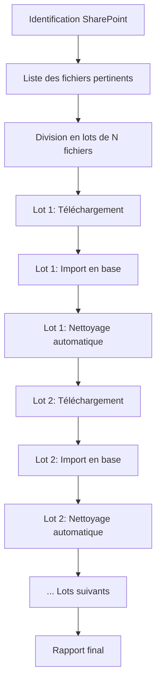

# Guide du traitement par lots DPGF

## Vue d'ensemble

Le nouveau système de traitement par lots permet de gérer efficacement de gros volumes de fichiers DPGF sans surcharger le système de stockage local. Au lieu de télécharger tous les fichiers d'un coup, le workflow procède par petits lots successifs avec nettoyage automatique.

## Principe de fonctionnement



## Avantages

### 🚀 Gestion mémoire optimisée
- **Stockage minimal** : Seuls 10-20 fichiers stockés localement à la fois
- **Évite la saturation** : Pas de téléchargement massif de centaines de GB
- **Nettoyage auto** : Suppression immédiate après import réussi

### 🔄 Processus robuste
- **Récupération partielle** : Échec d'un lot n'arrête pas le processus
- **Traçabilité** : Logs détaillés par lot
- **Reprise possible** : Peut reprendre au lot suivant en cas d'interruption

### 📊 Contrôle précis
- **Taille configurable** : Lots de 5 à 50 fichiers selon les besoins
- **Priorité** : Traitement par ordre de confiance décroissante
- **Monitoring** : Progression lot par lot avec statistiques

## Configuration

### Paramètres principaux

```json
{
  "scanning": {
    "batch_size": 10,           // Taille des lots (recommandé: 5-20)
    "max_files": 100,           // Total max de fichiers
    "min_confidence": 0.5       // Confiance minimum
  },
  "download": {
    "batch_processing": true,   // Activer le traitement par lots
    "auto_cleanup": true,       // Nettoyage automatique
    "max_batch_size_mb": 100    // Taille max d'un lot en MB
  }
}
```

### Tailles de lots recommandées

| Volume total | Taille de lot | Raison |
|--------------|---------------|---------|
| < 50 fichiers | 10 fichiers | Équilibre performance/mémoire |
| 50-200 fichiers | 15 fichiers | Optimisation des transferts |
| > 200 fichiers | 20 fichiers | Maximum d'efficacité |

## Utilisation

### Via l'interface batch
```bash
# Lancer l'interface
run_dpgf_workflow.bat

# Choisir option 1 (Workflow automatique)
# Le système utilise automatiquement des lots de 10 fichiers
```

### Via la ligne de commande
```bash
# Workflow avec lots personnalisés
python orchestrate_dpgf_workflow.py --auto \
    --batch-size 15 \
    --max-files 100 \
    --auto-cleanup

# Workflow interactif avec confirmation par lot
python orchestrate_dpgf_workflow.py --interactive \
    --batch-size 10 \
    --min-confidence 0.7
```

### Configuration personnalisée
```bash
# Gros volumes avec petits lots
python orchestrate_dpgf_workflow.py --auto \
    --batch-size 5 \
    --max-files 500 \
    --min-confidence 0.8

# Traitement rapide avec gros lots
python orchestrate_dpgf_workflow.py --auto \
    --batch-size 25 \
    --max-files 100 \
    --min-confidence 0.3
```

## Monitoring du processus

### Structure des répertoires
```
dpgf_workflow/
├── downloaded_files/
│   ├── batch_0/              # Lot en cours de traitement
│   │   ├── DPGF_file1.xlsx
│   │   └── batch_0_info.json
│   └── batch_1/              # Sera supprimé après import
├── reports/
│   └── workflow_report_xxx.txt
└── logs/
    ├── orchestration_dpgf.log
    └── batch_processing.log
```

### Exemple de progression
```
🔄 Traitement de 47 fichiers en 5 lots de 10 fichiers

📦 Lot 1/5: Traitement de 10 fichiers
⬇️ Téléchargement du lot 1...
✅ Lot 1 téléchargé: 10 fichiers (85.2 MB)
📊 Import du lot 1 en base de données...
📊 Lot 1 importé: 9/10 fichiers réussis
🧹 Lot 1 nettoyé: 85.2 MB libérés

📦 Lot 2/5: Traitement de 10 fichiers
⬇️ Téléchargement du lot 2...
✅ Lot 2 téléchargé: 10 fichiers (92.1 MB)
...
```

## Gestion des erreurs

### Erreurs non-critiques (continuent)
- **Échec téléchargement** d'un fichier spécifique → Skip et continue
- **Erreur import** d'un fichier → Import des autres du lot
- **Timeout réseau** → Retry automatique

### Erreurs critiques (arrêt)
- **Échec authentification** SharePoint
- **API backend** inaccessible
- **Espace disque** insuffisant

### Récupération d'erreurs
```bash
# Reprendre après interruption
python orchestrate_dpgf_workflow.py --auto \
    --batch-size 10 \
    --resume-from-batch 3  # Reprendre au lot 3
```

## Optimisations par contexte

### Environnement limité en espace
```bash
# Très petits lots avec nettoyage agressif
python orchestrate_dpgf_workflow.py --auto \
    --batch-size 5 \
    --auto-cleanup \
    --max-files 50
```

### Connexion réseau lente
```bash
# Lots plus petits, moins de timeouts
python orchestrate_dpgf_workflow.py --auto \
    --batch-size 8 \
    --deep-scan false \  # Plus rapide
    --max-files 40
```

### Traitement de nuit automatisé
```bash
# Lots moyens avec gestion d'erreurs robuste
python orchestrate_dpgf_workflow.py --auto \
    --batch-size 15 \
    --max-files 200 \
    --min-confidence 0.6 \
    --auto-cleanup
```

## Scripts de maintenance

### Nettoyage manuel
```bash
# Supprimer tous les fichiers temporaires
python -c "
import shutil
from pathlib import Path
if Path('dpgf_workflow/downloaded_files').exists():
    shutil.rmtree('dpgf_workflow/downloaded_files')
    print('🧹 Fichiers temporaires supprimés')
"
```

### Vérification de l'espace disque
```bash
# Vérifier l'espace avant traitement
python -c "
import shutil
free_gb = shutil.disk_usage('.').free / (1024**3)
print(f'💾 Espace libre: {free_gb:.1f} GB')
if free_gb < 5:
    print('⚠️ Espace insuffisant - utilisez des lots plus petits')
"
```

### Estimation de la durée
```bash
# Estimer le temps total
python -c "
files = 100  # Nombre de fichiers
batch_size = 10
avg_time_per_batch = 5  # minutes
total_time = (files / batch_size) * avg_time_per_batch
print(f'⏱️ Temps estimé: {total_time:.0f} minutes')
"
```

## Surveillance automatique

### Script de monitoring
```python
# monitor_workflow.py
import time
import json
from pathlib import Path

def monitor_progress():
    """Surveille la progression du workflow"""
    while True:
        try:
            # Lire les logs d'orchestration
            log_file = Path('dpgf_workflow/logs/orchestration_dpgf.log')
            if log_file.exists():
                with open(log_file, 'r', encoding='utf-8') as f:
                    lines = f.readlines()
                    # Analyser la progression
                    for line in reversed(lines[-10:]):
                        if "Lot" in line and "terminé" in line:
                            print(f"📊 {line.strip()}")
                            break
            
            time.sleep(30)  # Vérifier toutes les 30 secondes
            
        except KeyboardInterrupt:
            break
        except Exception as e:
            print(f"Erreur monitoring: {e}")
            time.sleep(60)

if __name__ == "__main__":
    monitor_progress()
```

### Alertes par email (optionnel)
```python
# Configuration dans workflow_config.json
{
  "notifications": {
    "email": {
      "enabled": true,
      "on_batch_complete": true,
      "on_error": true,
      "recipients": ["admin@company.com"]
    }
  }
}
```

## Bonnes pratiques

### 💡 Recommandations générales
1. **Commencer petit** : Test avec 1-2 lots avant le traitement complet
2. **Surveiller l'espace** : Vérifier l'espace disque disponible
3. **Horaires optimaux** : Lancer pendant les heures creuses
4. **Sauvegarde** : Backup de la base avant gros imports

### 🚨 Erreurs à éviter
1. **Lots trop gros** : > 50 fichiers → risque de timeout
2. **Pas de nettoyage** : Saturation du disque
3. **Confiance trop basse** : Import de fichiers non pertinents
4. **Interruption manuelle** : Laisser le processus se terminer

### 🎯 Optimisations
1. **Trier par taille** : Petits fichiers en premier
2. **Filtrage strict** : Confiance ≥ 0.5 pour production
3. **Monitoring actif** : Surveiller les logs en temps réel
4. **Tests réguliers** : Valider les imports en base

Le traitement par lots transforme la gestion de gros volumes DPGF en un processus maîtrisé et efficace ! 🚀
